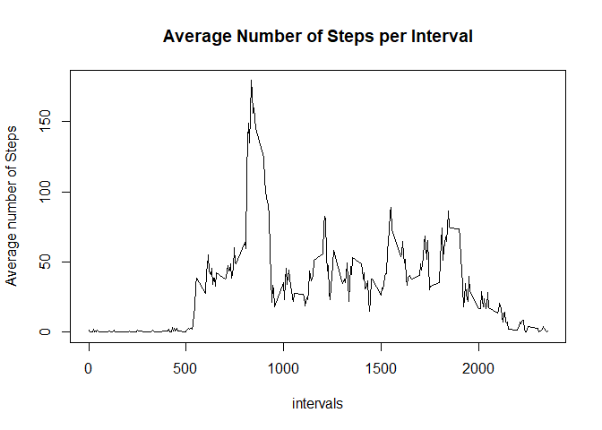
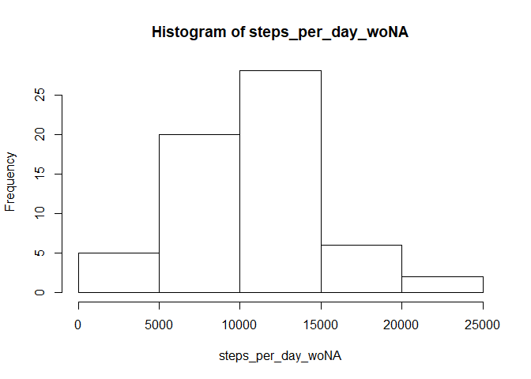
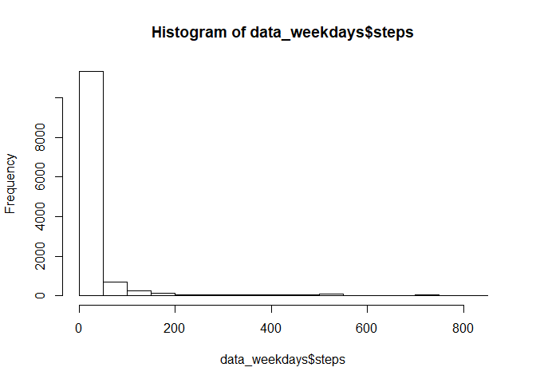
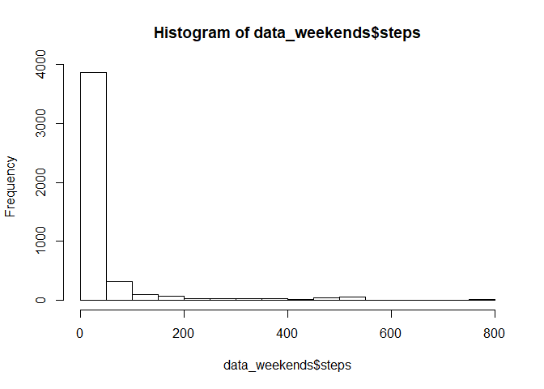
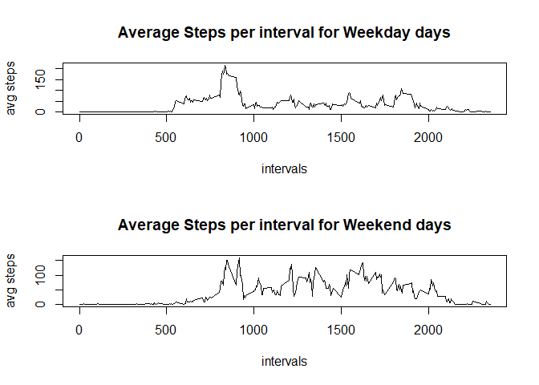

# Reproducible Research: Peer Assessment 1
Mark Giroux, 9-Jul-2017


# 1. Unzip and load data

```r
data <- read.csv(unz("activity.zip", "activity.csv"))
```
  
  
# 2. Steps per day

### Calculate total number of steps taken per day

```r
days <- unique(data$date)

steps_per_day <- rep(0, length(days))
for (i in 1:length(days))
{
    steps_per_day[i] <- sum(data$steps[data$date == days[i]], na.rm=TRUE)
}
```

### Histogram of the total number of steps taken each day

```r
hist(steps_per_day)
```

<!-- -->

### Mean total number of steps taken per day

```r
avg_steps_per_day <- mean(steps_per_day)
avg_steps_per_day
```

```
## [1] 9354.23
```

### Median total number of steps taken per day

```r
med_steps_per_day <- median(steps_per_day)
med_steps_per_day
```

```
## [1] 10395
```
  
  
# 3. Average daily activity pattern
  
### Calculate Steps per interval

```r
intervals <- unique(data$interval)

steps_per_interval <- rep(0, length(intervals))
for (i in 1:length(intervals))
{
    steps_per_interval[i] <- sum(data$steps[data$interval == intervals[i]], na.rm=TRUE)
}
```

### Calculate Average Steps per Interval, averaged across all days

```r
avg_steps_per_interval <- steps_per_interval / length(days)
```

### Time series plot of the 5-minute interval (x-axis) vs. average number of steps taken  (y-axis)

```r
plot(intervals, avg_steps_per_interval, type="l", main="Average Number of Steps per Interval", ylab="Average number of Steps")
```

<!-- -->

### 5-minute interval, which on average across all the days in the dataset, contains the maximum number of steps

```r
loc <- which(avg_steps_per_interval %in% max(avg_steps_per_interval) )

max_avg_steps_interval <- intervals[loc]
max_avg_steps_interval
```

```
## [1] 835
```
  
  
  
# 4. Imputing missing values

### Calculate and report the total number of missing values in the dataset (i.e. the total number of rows with NAs)

```r
num_rows_with_na <- sum(is.na(data))

num_rows_with_na
```

```
## [1] 2304
```

### Strategy for filling in all of the missing values in the dataset:
Calculate the mean of the   
(a) mean for the day (across all 5-min periods) and  
(b) mean of the 5 minute period (across all days)   

### Create a new dataset that is equal to the original dataset 

```r
data_woNA <- data
```

### Calculate Imputed values and update new data frame 

```r
for (i in 1:nrow(data))
{
    if (is.na(data$steps[i]))
    {
        #calcualte average for that day
        tot_steps_day <- sum(data$steps[data$date == data$date[i]], na.rm=TRUE)
        avg_steps_day <- max(0, tot_steps_day / (length(intervals) - sum(is.na(data$steps[data$date == data$date[i]]), na.rm=TRUE)), na.rm=TRUE)
    
        #calcuate average for that period
        tot_steps_int <- sum(data$steps[data$interval == data$interval[i]], na.rm=TRUE)
        avg_steps_int <- max(0, tot_steps_int / (length(days) - sum(is.na(data$steps[data$interval == data$interval[i]]), na.rm=TRUE)), na.rm=TRUE)

        #calculate imputed value as mean of avg steps for that day and avg steps for that period
        imputed_value <- (avg_steps_day + avg_steps_int) / 2 

        #update new data frame with imputed values
        data_woNA$steps[i] <- imputed_value
    }
    
}
```

## Calculate and report the mean and median total number of steps taken per day.

### calculate total number of steps taken per day (with Imputed values)

```r
days <- unique(data_woNA$date)

steps_per_day_woNA <- rep(0, length(days))
for (i in 1:length(days))
{
    steps_per_day_woNA[i] <- sum(data_woNA$steps[data_woNA$date == days[i]], na.rm=TRUE)
}
```

### Mean total number of steps taken per day (with Imputed Values)

```r
avg_steps_per_day_woNA <- mean(steps_per_day_woNA)
avg_steps_per_day_woNA
```

```
## [1] 10060.21
```

### Median total number of steps taken per day (with Imputed Values)

```r
med_steps_per_day_woNA <- median(steps_per_day_woNA)
med_steps_per_day_woNA
```

```
## [1] 10395
```

### Histogram of the total number of steps taken each day 

```r
hist(steps_per_day_woNA)
```

<!-- -->

### Do these values differ from the estimates from the first part of the assignment? What is the impact of imputing missing data on the estimates of the total daily number of steps?

Before imputing, mean was 9354.2295082, after imputing, mean was 1.0060209\times 10^{4}  
- The mean does differ, but very slightly. Based on my  strategy of taking the average of the average of the period and day, I would expect to have as little impact on the overall mean.  Had I used only the mean of that day, or of that period, then it may have had a larger impact on the overall mean.  
   
Before imputing, median was 1.0395\times 10^{4}, after imputing, median was 1.0395\times 10^{4}  
- The median does not differ, which makes sense. I don't think imputing values, using my strategy, would have created a new value that would have been the most frequent  


# 5. Explore differences in activity patterns between weekdays and weekends

### convert date column to Date data type

```r
data_woNA$date <- as.Date(data_woNA$date)
```

### add new column for weekday or weekend

```r
day_type <- rep(NA, nrow(data_woNA))
data_woNA <- cbind(data_woNA, day_type)

weekday <- c("Monday", "Tuesday", "Wednesday", "Thursday", "Friday")
weekend <- c("Saturday", "Sunday")

#if day of week is Mon,Tue,Wed,Thu,Fri; update day_type <- "weekday"
#if day of week is Sat, Sun; update day_type <- "weekend"
for (i in 1:nrow(data_woNA))
{
    if (weekdays(data_woNA$date[i]) %in% weekday)
        data_woNA$day_type[i] <- "weekday"
    if (weekdays(data_woNA$date[i]) %in% weekend)
        data_woNA$day_type[i] <- "weekend"
}
```
  
  
## Weekday

### create data frame of just weekday days

```r
data_weekdays <- data_woNA[(data_woNA$day_type == "weekday"), ]
```

### Calculate Total Steps per Weekday

```r
weekday_days <- unique(data_weekdays$date)

steps_per_weekday_day <- rep(0, length(weekday_days))

for (i in 1:length(weekday_days))
{
    steps_per_weekday_day[i] <- sum(data_weekdays$steps[data_weekdays$date == weekday_days[i]], na.rm=TRUE)
}

steps_per_weekday_day
```

```
##  [1]  5383.094   126.000 11352.000 12116.000 13294.000  5383.094 12811.000
##  [8]  9900.000 10304.000 17382.000 10139.000 15084.000 13452.000 10056.000
## [15] 11829.000 13460.000  8918.000  8355.000  2492.000  6778.000  5018.000
## [22]  9819.000 15414.000  5383.094 10600.000 10439.000  8334.000 12883.000
## [29]  3219.000  5383.094 10765.000  7336.000  5383.094    41.000  5441.000
## [36]  8841.000  4472.000 12787.000 20427.000 21194.000 11162.000 13646.000
## [43] 10183.000  7047.000  5383.094
```

### Mean Steps for Weekday

```r
avg_steps_per_weekday_day <- mean(steps_per_weekday_day)
avg_steps_per_weekday_day
```

```
## [1] 9538.101
```

### Median Steps for Weekday

```r
med_steps_per_weekday_day <- median(steps_per_weekday_day)
med_steps_per_weekday_day
```

```
## [1] 10056
```

### Historgram of Steps for Weekday

```r
hist(data_weekdays$steps)
```

<!-- -->


### Activity Pattern for Weekday

### Calculate Steps per interval for Weekdays

```r
intervals <- unique(data_weekdays$interval)

steps_per_interval_weekday <- rep(0, length(intervals))

for (i in 1:length(intervals))
{
    steps_per_interval_weekday[i] <- sum(data_weekdays$steps[data_weekdays$interval == intervals[i]], na.rm=TRUE)
}
```

### Calcualte Average Steps per Interval, averaged across all weekdays

```r
avg_steps_per_interval_weekday <- steps_per_interval_weekday / length(weekday_days)
```


## Weekend

### create data frame of just weekend days

```r
data_weekends <- data_woNA[(data_woNA$day_type == "weekend"), ]
```

### Calculate Total Steps per Weekend day

```r
weekend_days <- unique(data_weekends$date)

steps_per_weekend_day <- rep(0, length(weekend_days))

for (i in 1:length(weekend_days))
{
    steps_per_weekend_day[i] <- sum(data_weekends$steps[data_weekends$date == weekend_days[i]], na.rm=TRUE)
}

steps_per_weekend_day
```

```
##  [1] 15420.000 11015.000 12426.000 15098.000 10395.000  8821.000 10119.000
##  [8] 11458.000 10571.000  5383.094  5383.094 12608.000 14339.000 15110.000
## [15] 14478.000 11834.000
```

### Mean Steps for Weekend

```r
avg_steps_per_weekend_day <- mean(steps_per_weekend_day)
avg_steps_per_weekend_day
```

```
## [1] 11528.64
```

### Median Steps for Weekend

```r
med_steps_per_weekend_day <- median(steps_per_weekend_day)
med_steps_per_weekend_day
```

```
## [1] 11646
```

### Historgram of Steps for Weekend

```r
hist(data_weekends$steps)
```

<!-- -->


### Activity Pattern for Weekend

### Calculate Steps per interval for Weekend

```r
intervals <- unique(data_weekends$interval)

steps_per_interval_weekend <- rep(0, length(intervals))

for (i in 1:length(intervals))
{
    steps_per_interval_weekend[i] <- sum(data_weekends$steps[data_weekends$interval == intervals[i]], na.rm=TRUE)
}
```

### Calcualte Average Steps per Interval, averaged across all weekends

```r
avg_steps_per_interval_weekend <- steps_per_interval_weekend / length(weekend_days)
```
  
  
  
### Panel plot comparing the average number of steps taken per 5-minute interval across weekdays and weekends

```r
opar <- par(mfrow = c(2,1))

plot(intervals, avg_steps_per_interval_weekday, type="l", ylab="avg steps", main="Average Steps per interval for Weekday days")
plot(intervals, avg_steps_per_interval_weekend, type="l", ylab="avg steps", main="Average Steps per interval for Weekend days")
```

<!-- -->


### Differences in activity patterns between weekdays and weekends
The main difference between weekday and weekend activity pattern is the average number of steps taken during intervals 1000 through 1750, which is higher on weekeneds. These intervals equate to the time period of about 10:00am - 5:30pm which is when most people are at work on weekdays and thus the lower average number of steps taken makes sense.

